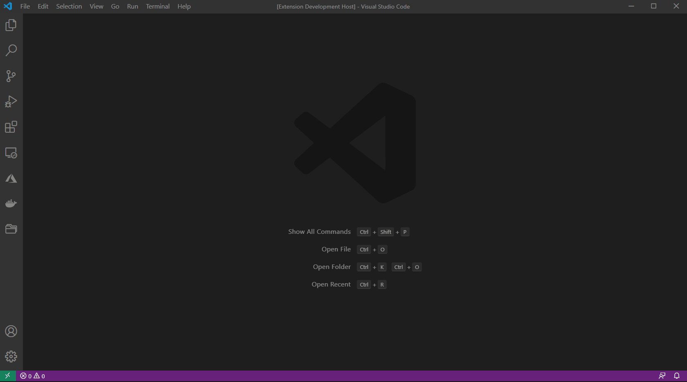
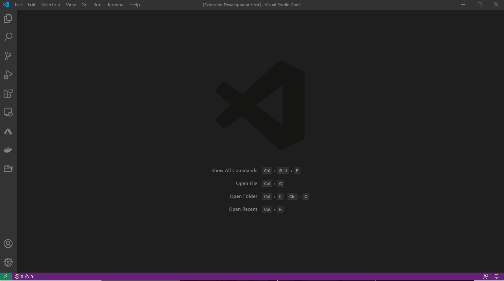

# VSCode JsonMap

The JsonMap extension provides the capabilities of running javascript commands like: map, filter, find, reduce and more in your open Json files, making it easier and quicker to extract insights of temporary files without needing to install additional software or creating temporary code.

## Features

* Get only the names of a JSON Array using ```.map``` function
<br/><br/>

<br/><br/>

* Get only the records of a JSON Array with age greater than 30 using ```.filter``` function
<br/><br/>

<br/><br/>

* Find the record with an specific name on a JSON Array using ```.find``` function
<br/><br/>
 
<br/><br/>

* Get the sum of all ages in a JSON Array using ```.reduce``` function
<br/><br/>

<br/><br/>

## How to use it

1. Install the extension
2. Open your JSON file in your VSCode editor
3. Open the command window (```ctrl+shift+p``` on widows) and search for the command ```JsonMap: Open Command Parser```
4. Enter your parse command. (e.g.: ```data.map(x => x.name)```)

## Known Issues

- None

## Release Notes


* 0.1.0
    * Initial Relase of JsonMap Extension